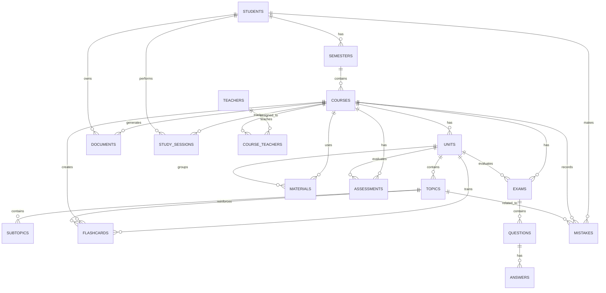

# EAWS — Engineering Academic Workspace

## 1. Resumen

EAWS es un espacio académico inteligente diseñado para acompañar al estudiante durante toda su carrera universitaria. El sistema no se limita a la redacción de documentos, sino que también organiza materias, docentes, sílabos, diapositivas, recursos de estudio, evaluaciones, errores, progreso académico y estrategias de aprendizaje.

La arquitectura combina documentación en archivos Markdown, una base de datos para la información estructurada y almacenamiento físico para archivos académicos como diapositivas, tareas, exámenes, laboratorios, datasets, notebooks y documentos generados. De esta manera, el sistema puede crecer por semestres, materias y evaluaciones sin convertirse en una carpeta desordenada de archivos.

## 2. Objetivo

Construir una plataforma académica modular que permita centralizar, organizar y reutilizar el conocimiento del estudiante para apoyar la redacción académica, el aprendizaje, la preparación de exámenes y el seguimiento del progreso universitario.

---

# 3. Arquitectura del repositorio

```text
eaws-app/
│
├── docs/
│   ├── ARCHITECTURE.md
│   ├── ROADMAP.md
│   ├── CHANGELOG.md
│   ├── DECISIONS.md
│   ├── DOMAIN_MODEL.md
│   ├── DATA_ARCHITECTURE.md
│   └── AI_ARCHITECTURE.md
│
├── config/
│   ├── app/
│   ├── database/
│   ├── models/
│   └── environment/
│
├── engine/
│   ├── academic_agent/
│   ├── writing_agent/
│   ├── learning_agent/
│   ├── exam_agent/
│   ├── tutor_agent/
│   ├── memory_agent/
│   └── recommendation_agent/
│
├── database/
│   ├── schema.sql
│   ├── seed.sql
│   └── README.md
│
├── storage/
│   ├── slides/
│   ├── assignments/
│   ├── exams/
│   ├── labs/
│   ├── datasets/
│   ├── notebooks/
│   ├── generated_documents/
│   └── media/
│
├── templates/
│   ├── essays/
│   ├── reports/
│   ├── laboratory_reports/
│   ├── presentations/
│   ├── study_guides/
│   ├── exams/
│   └── rubrics/
│
├── prompts/
│   ├── system/
│   ├── writing/
│   ├── learning/
│   ├── exams/
│   ├── tutoring/
│   └── feedback/
│
├── tests/
│   ├── engine/
│   ├── database/
│   └── workflows/
│
├── docker-compose.yml
├── README.md
├── CHANGELOG.md
├── LICENSE
└── .gitignore
```

---

# 4. Arquitectura de la base de datos



---

# 5. Explicación de módulos

## 5.1 docs/

Contiene la documentación principal del proyecto. Aquí se define la arquitectura, el roadmap, las decisiones técnicas, el modelo de dominio, la arquitectura de datos y la arquitectura de IA. No guarda datos reales del estudiante.

## 5.2 config/

Guarda configuraciones del sistema, base de datos, modelos de IA y variables de entorno. Permite cambiar parámetros sin modificar la lógica principal del proyecto.

## 5.3 engine/

Contiene la lógica inteligente de EAWS. Incluye agentes para redacción académica, aprendizaje, preparación de exámenes, tutoría, memoria académica y recomendaciones.

## 5.4 database/

Contiene la estructura de la base de datos y los datos iniciales del sistema. En esta versión se maneja con `schema.sql`, `seed.sql` y un archivo `README.md`.

## 5.5 storage/

Guarda los archivos académicos reales del estudiante, como diapositivas, tareas, exámenes, laboratorios, datasets, notebooks, documentos generados y recursos multimedia.

## 5.6 templates/

Contiene plantillas reutilizables para ensayos, informes, reportes de laboratorio, presentaciones, guías de estudio, exámenes y rúbricas.

## 5.7 prompts/

Guarda las instrucciones que controlan el comportamiento de los agentes. Separa prompts del sistema, redacción, aprendizaje, exámenes, tutoría y retroalimentación.

## 5.8 tests/

Contiene pruebas para validar agentes, base de datos y flujos principales del sistema.

## 5.9 docker-compose.yml

Define los servicios necesarios para ejecutar EAWS en contenedores. En esta etapa basta con un archivo principal para levantar la base de datos y los servicios mínimos.

## 5.10 README.md

Presenta el proyecto, su objetivo, instalación básica y forma de uso.

## 5.11 CHANGELOG.md

Registra los cambios importantes realizados en el proyecto.

## 5.12 LICENSE

Define la licencia abierta del proyecto. Para exigir atribución obligatoria, se recomienda usar una licencia compatible con atribución explícita.

## 5.13.gitignore

Evita subir archivos innecesarios o sensibles al repositorio, como variables de entorno, dependencias, caché o archivos temporales.
